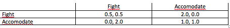

% Game Theory 2
% Assignment 1
% Hidde Kienstra (902873), Tilburg University

1.1 
================

----

a)
----

A has 1 type. Types of T are different firm values (x) distributed over [0.1]. 

$A_A$ bids Y to take over T, Y distributed over [0, $\infty$]. 

$A_T$= reject or accept Y 

T will only accept Y if $$Y\ge X$$

--------

A beliefs X is drawn from CDF $F(X)=X(2-X)$, T knows own X

Strategy A: Bid $$\Rightarrow Y [0, {\infty}]$$

Strategy T: to accept or reject Y $\Rightarrow$ T only accepts if: $$Y\ge X$$

*Pay offs:* 
$$U_A(Y, Accept)=2X-Y$$
$$U_A(Y, Reject)=0$$
$$U_T(Y, Accept)=Y$$
$$U_T(Y, Reject)=X$$

---------

b)
---

$$E(X)= \int^{\infty}_{-\infty} x *f(x) \, dx $$

$$F(X)=X(2-X)=X^2+2X$$

$$f(X)=F'=-2x+2$$

$$E(X)=\int_{0}^{1} x(-2x+2) dx $$

----------

$$=\int_{0}^{1} -2x^2+2 dx= $$

$$=\frac{-2}{3}X^3+X^2$$

$$=\frac{-2}{3}*1+1^2=\frac{1}{3}$$

-----------

c)
---
  
Firm value is distributed over $$[0.1]$$ 

T will only accept Y if: $$\Rightarrow Y\ge X$$
A can bid below or higher than 1, if bid is equal or higher than 1 T will always accept (max firm value=1) 

$$\Rightarrow E(X|X\le Y)$$ is the expected X of firm that accepts Y. 

$$\Rightarrow E(X|X\le Y)=\frac{\int_{0}^{Y} x*f(x) dx }{F(Y)}$$

---------

$$f(x)=-2x+2$$

$$=\int_{0}^{Y} x(-2x+2) dx= $$

$$=\int_{0}^{Y} (-2x^2+2)  dx= $$

$$=[\frac{-2}{3}X^3+X^2]^{X=Y}_{X=0}$$

$$=\frac{-2}{3}Y^3+Y^2$$

$$F(Y)=Y(2-Y)$$

$$E(X|X\le Y)= \frac{-2\frac{-2}{3}Y^3+Y^2}{-Y^2+2Y}$$

--------

The expected value of a firm if it accepts is $$= E(X|X\le Y)= \frac{-2\frac{-2}{3}Y^3+Y^2}{-Y^2+2Y}$$ if $Y\le 1$, if $Y\ge 1$ all types will accept, expected value of all types is $$\Rightarrow \frac{1}{3}$$ 

Pay off A if $Y\le 1:$ $$= 2x-Y=2( \frac{-2\frac{-2}{3}Y^3+Y^2}{-Y^2+2Y})-Y$$

-----

which is $\le0$ on interval [0,1]. 

Payoff A if $Y\ge1$ $$=2*\frac{1}{3}-Y\le0$$

Nash equilibrium is for A to bid 0. 

------
d)
---
A can generate profit from buying T, because it values it higher than T's own management does. However T only accepts bids above own value, on average as you lower bid the probability that target firm has good value decreases, creating an adverse selection problem. 

1.2
==========

-----

a)
---

$$\pi=[V((a-q_1(L)-q_2(L)-C_L)\cdot q_1(L))+(1-V)((a-q_1(L)-q_2(H)-C_L)\cdot q_1(L))+V((a-q_1(H)-q_2(H)-C_L)\cdot q_1(H))+(1-V)((a-q_1(H)-q_2(H)-C_L)\cdot q_1(L))]$$

$$\pi_1'(L) \Rightarrow q_1(L) \frac{[a-q_2(L)-c_L]V+[a-q_2(H)-c_L]1-V}{2}$$

$$\pi_1'(H) \Rightarrow q_1(H)= \frac{[a-q_2(L)-c_H]V+[a-q_2(H)-c_H]1-V}{2}$$

$$\pi_1'(L) \Rightarrow q_2(L) \frac{[a-q_1(L)-c_L]V+[a-q_1(H)-c_L]1-V}{2}$$

$$\pi_2'(H) \Rightarrow q_2(H)= \frac{[a-q_1(L)-c_H]V+[a-q_1(H)-c_H]1-V}{2}$$

----

b)
---
A strategy for i is how much to produce given that j is expected to certain Q determined wheter it has low cost or high cost. 

------

c)
---
Assuming symmetry of firm 1 & 2
$q_1(L)=q_2(L)$

and

$q_1(H)=q_2(H)$\

$$\Rightarrow q(L)=\frac{a-(1+V)q(H)-c_L}{2+V}$$
$$\Rightarrow q(H)=\frac{a-Vq(L)-c_H}{3-V}$$

1.3 
===============

----

a)
----

------

b)
---
With k=0.5 the game is a prisoners dilemma with the pure strategy Nash equilibrium (Fight, Fight). 

With k=2 the game is a type of coordination game which is called chicken game. This game has two pure strategy Nash equilibria which are (Fight,Accomodate) and (Accomodate,Fight). 

------

b)
---
Type: $$\theta_1=(k=0.5,k=2)$$
$$\theta_2=(k=0.5\times p,k=2\times(1-p))$$
Action: $$A={Accomodate,Fight}$$

	

 